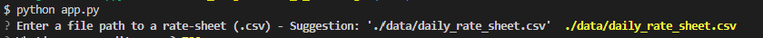
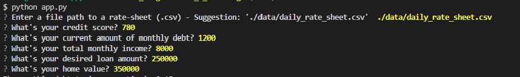
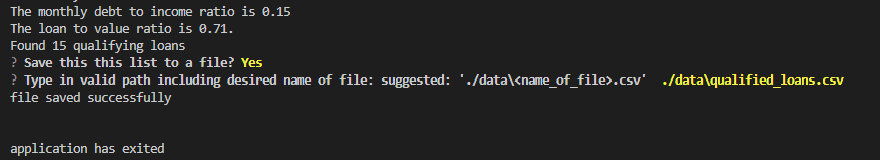

# Home Loan Application 

This project will help those who want to find a bank that will give them a desired home loan. The user must input their credit score, monthly income, debt, desired loan amount, and the value of the house they will use their loan to buy. The application will then provide a list of banks that will most likely allow the user to take out the desired loan based on the credit score, debt-to-income ratio and loan-to-value ratio calculated within the app. 

---

## Technologies

Language: Python 3.9.12 

Libraries used not included in python:

[Fire](https://github.com/google/python-fire) - For seamlessly running the application from the CLI

[Questionary](https://github.com/tmbo/questionary) - For interactive user prompts and easy entry

---

## Installation Guide

Before running this application be sure to install the necessary dependencies:

```python
    pip install fire
    pip install questionary
```

---

## Usage

To run the application clone the repository and run **app.py** while in the correct directory 

```python
    python app.py
```

The first thing the application will ask you for is to enter a file path to the 
necessary data. Make sure to enter the following: **'./data/daily_rate_sheet.csv'** 
or if you have an identically formatted csv file you may direct the application to 
that file path.

Next: Enter in your credit score followed by the monthly values for debt and income. Enter the requested loan amount and the value of the house you are to use the loan for.

Finally: if you have a list of loans you would like to save enter a file path and then give your csv a **<name_of_list>.csv**. Your .csv file will be created. It is recommended
to format your file entry as **./data\<name_of_list.csv>** so the program stores your file in the same location as the intial .csv file read and the associated files for and from this app are in similar locations.

### Here is what it should look like:







---

## Contributors

Created by Silvano Ross while in the UW FinTech Bootcamp
> Contact Info:
> email: silvanoross3@gmail.com |
> [GitHub](https://github.com/silvanoross) |
> [LinkedIn](https://www.linkedin.com/in/silvano-ross-b6a15a93/)
---

## License

[MIT](LICENSE)
